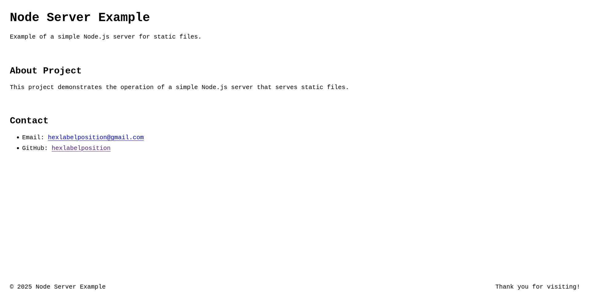

# node-server-example

[](https://nodejs.org/)

A server written in JavaScript using Node.js without any frameworks.

## Badges

[](https://opensource.org/licenses/MIT)


## Requirements

- **Node.js** (v14.13.0 or higher)s
- **npm** (comes with Node.js)
- **Git** (for cloning the repository)

## Features

- Basic HTTP server
- Serves static files from the `public` directory
- Environment variable configuration using a `.env` file
- Simple routing
- Error handling
- ESM module project

## Installation

Install **Node.js** from [nodejs.org](https://nodejs.org/).

Install **Git** from [git-scm.com](https://git-scm.com/).

Check that you have **Node.js** and **npm** installed:

```bash
node -v

# output example: v20.5.1
```

```bash
npm -v

# output example: 9.8.1
```

Check that you have **Git** installed:

```bash
git --version

# output example: git version 2.51.0
```

Then, clone this repository using Git:

```bash
git clone https://github.com/hexlabelposition/node-server-example.git
```

Navigate to the project directory:

```bash
cd node-server-example
```

## Usage

Start the server in production mode:

```bash
npm run start
```

Start the server in development mode with automatic restarts on file changes:

```bash
npm run dev
```

Run command to create a `.env` file from the example file:

```bash
npm run env:create
```

Run command to check the code for issues:

```bash
npm run test
```

## Structure

The project structure is as follows:

```text
docs/               // Documentation files
└── nodejs.svg      // Node.js logo
└── screenshot.png  // Screenshot image
public/             // Static files served by the server
├── favicon.svg         // Favicon file
├── global.css          // Global CSS file
└── index.html          // Main HTML file
src/                // Source code for the server
└── server.js           // Main server file
.env.example        // Example environment variables file
LICENSE             // License information
package.json        // Project metadata and dependencies
README.md           // Project documentation
```

## Screenshot

The HTML page served by the server:



## Acknowledgements

- [hcoz/pure-nodejs-web-server](https://github.com/hcoz/pure-nodejs-web-server) — cjs and pure Node.js server.
- [Wehzie/Node-mini-server](https://github.com/Wehzie/Node-mini-server) — minimal Node.js server.
- [Shubh1202/Nodejs-CRUD-API](https://github.com/Shubh1202/Nodejs-CRUD-API-without-framework-and-database) — Node.js CRUD API without framework and database.
- [FarrelAD/Basic-Web-Server-NodeJS](https://github.com/FarrelAD/Basic-Web-Server-NodeJS) — Basic Web Server using NodeJS without any framework.

## License

[MIT License](./LICENSE)
